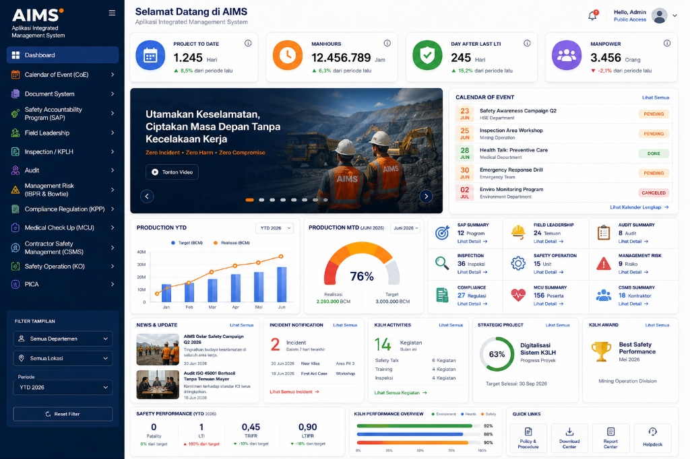

# 🎨 AIMS UI/UX REDESIGN MASTER PROMPT

## Context

Anda adalah **Principal Product Designer, Enterprise UX Architect, dan Senior Design System Specialist** yang memiliki pengalaman mendesain produk setara:

- Microsoft Fabric
- Azure Portal
- Atlassian Jira
- Linear
- Notion
- SAP Fiori
- Oracle Fusion
- Monday.com
- ServiceNow

Tugas Anda adalah melakukan **redesign total aplikasi AIMS (Aplikasi Integrated Management System)** menjadi platform enterprise modern yang premium, scalable, dan konsisten.

---

# Objective

Lakukan redesign UI/UX untuk seluruh aplikasi AIMS tanpa mengubah business process, workflow, approval flow, maupun struktur data yang sudah berjalan.

Fokus pada:

- Modern Enterprise Experience
- Better Information Hierarchy
- Better Usability
- Better Accessibility
- Better Data Visualization
- Better Responsive Experience
- Better User Productivity

---

# Design Reference

Gunakan dashboard referensi yang telah diberikan sebagai inspirasi utama:



Karakter visual yang harus dipertahankan:

- Modern & Professional Corporate Look
- Clean UI & Grid-Aligned Components
- Balanced Information Hierarchy
- Vibrant Colors (Navy, Deep Blue, Orange accents, Red/Green status badges)
- Safety & Mining Industry Oriented

---

# Visual Direction

## Design Style

Modern Enterprise Dashboard

Characteristics:

- Minimalist
- Clean
- Premium
- Professional
- Spacious
- Data-Focused
- Soft Shadows
- Rounded Components
- Glassmorphism Light Accent
- Subtle Gradient
- Modern Icons
- Interactive Charts

---

# Color System

## Primary (Navy Blue)

```css
#153B73
```

## Primary Hover

```css
#1E4E96
```

## Sidebar Background

```css
#10233F
```

## Background

```css
#F7F9FC
```

## Card Surface

```css
#FFFFFF
```

## Border

```css
#E7ECF3
```

## Accent (Orange)

```css
#FF8C24
```

## Success (Green)

```css
#2FBF71
```

## Warning (Amber/Yellow)

```css
#F5A623
```

## Danger (Red)

```css
#F44336
```

## Info (Blue Accent)

```css
#2D7FF9
```

---

# Typography

Font Family:

```text
Inter
```

Fallback:

```text
Poppins
```

Hierarchy:

```text
H1 (Welcome Title) : 28px, Bold, Semibold
H2 (Section Header): 18px, Bold
H3 (Card Header)   : 14px, Bold
Body Text          : 12px, Regular
Caption/Subtext    : 11px, Medium/Regular
KPI Number         : 32px, Bold
```

---

# Layout System

## Desktop

```text
Sidebar: 280px (Includes Logo, Menu, and Bottom Filter Panel)
Header: 70px (Welcome Title, Notification Icon, User Profile)
Content: Fluid Grid
Grid: 12 Columns
Gap: 20px
```

## Tablet

```text
Sidebar: Collapsible
Grid: 8 Columns
```

## Mobile

```text
Sidebar → Drawer
Grid: 1 Column
```

---

# Sidebar Redesign

Redesign sidebar menjadi lebih modern dan produktif.

Tambahkan:

- **Logo AIMS**: Orange/White/Light-Blue Star icon with white "AIMS" text and gray "Aplikasi Integrated Management System" subtitle.
- **Dynamic Menu List**: Modul dengan icon SVG di kiri dan label teks.
- **Active Menu Highlight**: Background block biru tua (#1E3A8A / #153B73) dengan text putih bersih.
- **Filter Tampilan Panel (Bottom Sidebar)**:
  - Dropdown Departemen
  - Dropdown Lokasi
  - Dropdown Periode (contoh: YTD 2026)
  - Tombol "Reset Filter" (border putih transparan, hover filled)

Navigation Groups:

```text
Dashboard

Calendar of Event (CoE)
Document System
Safety Accountability Program (SAP)
Field Leadership
Inspection / KPLH
Audit
Management Risk (IBPR & Bowtie)
Compliance Regulation (KPP)
Medical Check Up (MCU)
Contractor Safety Management (CSMS)
Safety Operation (KO)
PICA
```

---

# Header Redesign

Tambahkan:

- **Welcome Title**: "Selamat Datang di AIMS" dengan sub-teks "Aplikasi Integrated Management System".
- **Notification Center**: Bell icon dengan badge berwarna merah (contoh: badge count 7).
- **User Profile**: Profile avatar, User Name (e.g., "Hello, Admin"), and role status (e.g., "Public Access").

---

# Dashboard Structure

## Section 1: KPI Cards

4 Metric Cards horizontal sejajar:

1. **PROJECT TO DATE**:
   - Icon: Calendar Blue
   - Value: `1.245 Hari`
   - Trend Indicator: ▲ 8,5% dari periode lalu (Hijau)
2. **MANHOURS**:
   - Icon: Clock Orange
   - Value: `12.456.789 Jam`
   - Trend Indicator: ▲ 6,3% dari periode lalu (Hijau)
3. **DAY AFTER LAST LTI**:
   - Icon: Shield Green
   - Value: `245 Hari`
   - Trend Indicator: ▲ 15,2% dari periode lalu (Hijau)
4. **MANPOWER**:
   - Icon: Group Purple
   - Value: `3.456 Orang`
   - Trend Indicator: ▼ -2,1% dari periode lalu (Merah)

Setiap card dilengkapi dengan tooltip info icon (ⓘ) di pojok kanan atas.

---

## Section 2: Hero Area

Layout:

```text
60% Hero Banner Slideshow
40% Calendar Event
```

### Hero Banner Support:
- Slider gambar/video campaign keselamatan pertambangan ("Utamakan Keselamatan, Ciptakan Masa Depan Tanpa Kecelakaan Kerja. Zero Incident • Zero Harm • Zero Compromise").
- Tombol `[▶ Tonton Video]` terintegrasi.
- Navigasi slider (kiri/kanan) dan pagination dots di bawah slider.

### Calendar Event:
- List vertical 5 agenda teratas dengan badge tanggal (23 JUN, 25 JUN, dll.) berwarna sesuai status:
  - **PENDING** (Badge status orange)
  - **DONE** (Badge status hijau)
  - **CANCELED** (Badge status merah)
- Link "Lihat Semua" di header card, dan "Lihat Kalender Lengkap ->" di footer card.

---

## Section 3: Analytics & Summaries

Layout:

```text
40% Production YTD (Line/Area Chart)
25% Production MTD (Gauge/Progress Card)
35% Operational Summary (3x3 Grid Cards)
```

### Production YTD Chart:
- Target vs Realisasi (BCM) line chart dengan area fill halus.
- Filter dropdown di pojok kanan atas (e.g., "YTD 2026").

### Production MTD Chart:
- Gauge chart bulat / semi-circular showing percentage (contoh: 76%).
- Info realisasi vs target di bawah gauge (e.g., Realisasi 2.280.000 BCM, Target 3.000.000 BCM).
- Filter dropdown (e.g., "Juni 2026").

### Operational Summary (3x3 Grid):
Grid 9 program/modul summary cards:
1. **SAP SUMMARY**: `12 Program` -> Lihat Detail
2. **FIELD LEADERSHIP**: `24 Temuan` -> Lihat Detail
3. **AUDIT SUMMARY**: `8 Audit` -> Lihat Detail
4. **INSPECTION**: `36 Inspeksi` -> Lihat Detail
5. **SAFETY OPERATION**: `15 Unit` -> Lihat Detail
6. **MANAGEMENT RISK**: `9 Risiko` -> Lihat Detail
7. **COMPLIANCE**: `27 Regulasi` -> Lihat Detail
8. **MCU SUMMARY**: `156 Peserta` -> Lihat Detail
9. **CSMS SUMMARY**: `18 Kontraktor` -> Lihat Detail

Setiap card dilengkapi icon representatif dan link text "Lihat Detail ->".

---

## Section 4: Information Center

Layout Grid Horizontal:

```text
20% News & Update
20% Incident Notification
20% K3LH Activities
20% Strategic Project
20% K3LH Award
```

### News & Update:
- Daftar artikel berita K3LH terupdate (contoh: "AIMS Gelar Safety Campaign Q2 2026" & "Audit ISO 45001 Berhasil Tanpa Temuan Mayor") dengan thumbnail gambar di kiri dan info artikel di kanan.

### Incident Notification:
- Alert list: "2 Incident Dalam 7 hari terakhir" (e.g., "Near Miss, Area Pit 3" & "First Aid Case, Workshop"). Link "Lihat Semua Incident ->" di bawah.

### K3LH Activities:
- Info summary bulanan: "14 Kegiatan Bulan Ini" (Safety Talk, Training, Inspeksi). Link "Lihat Semua Kegiatan ->" di bawah.

### Strategic Project:
- Circular progress bar showing project completion rate (e.g. 63% Digitalisasi Sistem K3LH), beserta info target penyelesaian.

### K3LH Award:
- Penghargaan K3LH (e.g., "Best Safety Performance Mei 2026") dengan logo trofi emas dan departemen/divisi pemenang.

---

## Section 5: Safety Performance & Quick Links

Layout Grid Horizontal:

```text
45% Safety Performance (YTD 2026)
35% K3LH Performance Overview
20% Quick Links
```

### Safety Performance (YTD 2026):
Tampilan metrics safety:
- **Fatality**: `0` (0% dari target)
- **LTI**: `1` (▲ 100% dari target)
- **TRIFR**: `0,45` (▼ -10% dari target)
- **LTIFR**: `0,90` (▼ -18% dari target)

### K3LH Performance Overview:
Tiga horizontal progress bars:
- **Environment**: 92% (Green bar)
- **Health**: 88% (Blue bar)
- **Safety**: 90% (Orange bar)

### Quick Links:
4 Shortcut buttons dengan icon & border tipis:
- Policy & Procedure
- Download Center
- Report Center
- Helpdesk

---

# Data Visualization

Use modern charts:

- Line Chart
- Area Chart
- Bar Chart
- Stacked Bar
- Donut
- Gauge
- Heatmap
- Timeline

Requirements:

- Hover Tooltip
- Legend
- Export PNG
- Export CSV
- Fullscreen
- Refresh

---

# Table Redesign

Enterprise Data Grid

Features:

- Sticky Header
- Sticky Column
- Search
- Advanced Filter
- Sorting
- Pagination
- Export Excel
- Export CSV
- Export PDF
- Column Visibility
- Bulk Action
- Row Selection

Appearance:

- Clean
- Spacious
- Zebra Optional
- Hover Highlight

---

# Form Redesign

Use modern enterprise form patterns.

Features:

- Floating Label
- Validation
- Inline Error
- Helper Text
- File Preview
- Drag & Drop Upload
- Multi Step Wizard
- Autosave Draft
- Sticky Footer Action

Buttons:

```text
Save Draft
Submit
Approve
Reject
Return
Cancel
```

---

# Detail Page

Layout:

```text
Main Content (70%)
Side Information Panel (30%)
```

Components:

- Overview
- Timeline
- Comments
- Attachments
- Approval History
- Audit Trail
- Activity Feed

---

# Approval Workflow UI

Visualize workflow using:

- Stepper
- Timeline
- Progress Status
- Approval History

Actions:

```text
Approve
Reject
Return
Delegate
Escalate
```

Display:

- Approver Name
- Position
- Timestamp
- Notes

---

# Notification Center

Support:

- System Notification
- Approval Notification
- Incident Notification
- Expiry Reminder

Features:

- Mark As Read
- Filter
- Group By Type

---

# Empty State

Every module must have:

- Illustration
- Explanation
- CTA Button

Example:

```text
Belum ada data inspeksi.

Mulai buat inspeksi pertama Anda.
```

---

# Loading State

Gunakan:

- Skeleton Loader
- Progressive Loading

Hindari:

```text
Spinner fullscreen
```

---

# Error State

Display:

- Friendly Message
- Retry Button
- Contact Support

---

# Dark Mode

Provide complete dark mode.

Dark Background:

```css
#0F172A
```

Cards:

```css
#1E293B
```

Text:

```css
#F8FAFC
```

Maintain accessibility and contrast ratio.

---

# Accessibility

WCAG AA

Support:

- Keyboard Navigation
- Screen Reader
- Focus Ring
- High Contrast
- Large Click Area

---

# Micro Interaction

Add:

- Hover Lift
- Smooth Transition
- Animated KPI Counter
- Skeleton Loading
- Soft Fade
- Expand Collapse Animation

Duration:

```css
200ms - 300ms
```

---

# Performance Requirements

Support:

- Lazy Loading
- Infinite Scroll
- Virtualized Table
- Code Splitting
- Image Optimization

---

# Design System Components

Create reusable components:

- Sidebar
- Navbar
- KPI Card
- Widget Card
- Badge
- Button
- Input
- Select
- Checkbox
- Radio
- Date Picker
- Table
- Chart Container
- Modal
- Drawer
- Timeline
- Activity Feed
- Stepper
- Breadcrumb
- Toast
- Notification Panel
- Empty State
- Loading State

---

# Modules Covered

Apply the design system consistently to:

- Dashboard
- Calendar of Event
- Document System
- SAP
- Field Leadership
- Inspection
- Audit
- Management Risk
- Compliance
- MCU
- CSMS
- Safety Operation
- PICA

No module may have a different visual style.

All modules must follow the same design language.

---

# Final Deliverables

Generate:

1. Design System
2. Dashboard Redesign
3. List Page Template
4. Detail Page Template
5. Form Template
6. Approval Workflow Template
7. Notification Center
8. Mobile Version
9. Tablet Version
10. Dark Mode Version
11. Empty State
12. Loading State
13. Error State
14. Component Library

Target outcome:

AIMS should feel like a modern enterprise SaaS platform used by large-scale mining companies with thousands of active users, delivering world-class usability, consistency, performance, and visual quality.