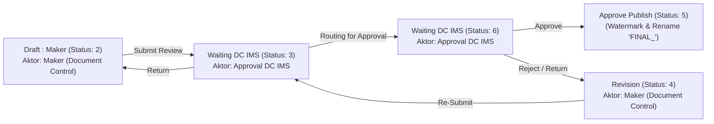

# Spesifikasi Alur Kerja & Pemetaan RBAC Sistem Dokumen (Document System Workflow & RBAC Specification)

Dokumen ini mendeskripsikan spesifikasi alur kerja (*workflow*) modul **Document System** pada AIMS v3, yang menyelaraskan peran (`aims_roles`), izin menu (`aims_permissions`), transisi status, serta aturan pengiriman email di setiap tahapnya.

---

## 1. Diagram Hubungan Peran, Status & Perizinan (RBAC Workflow Diagram)

---

## 2. Pemetaan Hak Akses Menu & Perizinan (AIMS Permissions)

Konfigurasi hak akses menu dilakukan pada tabel `aims_permissions` dengan pemetaan flag operasi berikut:

| Menu Slug (AIMS Menu) | Document Control (Maker) | Approval DC IMS (Compliance / Approver) |
| :--- | :---: | :---: |
| **`doc.dashboard`** | `can_view` | `can_view` |
| **`doc.maker`** | `can_view`, `can_create`, `can_edit` | `can_view`, `can_create`, `can_edit`, `can_delete`, `can_approval` |
| **`doc.ongoing`** | `can_view` | `can_view`, `can_create`, `can_edit`, `can_delete`, `can_approval` |
| **`doc.draft`** | `can_view`, `can_create`, `can_edit` | `can_view`, `can_create`, `can_edit`, `can_delete`, `can_approval` |
| **`doc.approval`** | - | `can_view`, `can_create`, `can_edit`, `can_delete`, `can_approval` |
| **`doc.obsolete`** | `can_view` | `can_view`, `can_create`, `can_edit`, `can_delete`, `can_approval` |

*Note: Pengguna ber-role `system_admin` atau `super_admin` otomatis melewati seluruh pembatasan menu dan memiliki izin penuh.*

---

## 3. Matriks Transisi Status & Alur Keputusan

### Tahap 1: Pengajuan Dokumen oleh Maker (Submit Review)
*   **Aktor**: Pengguna ber-role `document_control` (Maker).
*   **Status Dokumen**: `2` (Draft).
*   **Aksi**: Mengisi metadata dokumen, reviewer terundang ("Mengetahui"), dan mengunggah berkas PDF dasar.
*   **Transisi**: Maker mengirimkan dokumen -> Status berubah ke **`3` (Waiting DC IMS - Tahap 1: Routing to Approval)**. Notifikasi email dikirim ke tim ber-role `approval_dc_ims` (CC: reviewer "Mengetahui").

### Tahap 2: Tinjauan Awal oleh DC IMS (Routing to Approval / Return)
*   **Aktor**: Pengguna ber-role `approval_dc_ims` / memiliki izin `can_approval` di menu `doc.approval`.
*   **Status Dokumen**: `3` (Waiting DC IMS - Tahap 1).
*   **Aksi**:
    *   **Routing for Approval (Diteruskan)**: Status dokumen berubah menjadi **`6` (Waiting DC IMS - Tahap 2: Final Approval)**.
    *   **Return (Dikembalikan)**: Status dokumen kembali ke **`2` (Draft)** agar Maker dapat merevisi dokumen secara langsung.

### Tahap 3: Persetujuan Akhir oleh DC IMS (Approved to Publish)
*   **Aktor**: Pengguna ber-role `approval_dc_ims` / memiliki izin `can_approval` di menu `doc.approval`.
*   **Status Dokumen**: `6` (Waiting DC IMS - Tahap 2).
*   **Aksi**:
    *   **Setuju (Approve to Publish)**:
        1.  Status dokumen diubah menjadi **`5` (Active)**.
        2.  Sistem memicu watermark PDF (`applyWatermark` dengan mode `active`).
        3.  Sistem melakukan penggantian nama berkas PDF menjadi ber-awalan **`FINAL_`** di blob storage.
        4.  Mengirimkan notifikasi email final ke pembuat dokumen (Maker) dan para reviewer terundang.
        5.  Dokumen hilang dari daftar persetujuan DC IMS.
    *   **Tolak / Kembalikan (Reject / Return)**: Status dokumen dialihkan ke **`4` (On Revision)**. Maker memperbaiki dokumen dan melakukan **Re-Submit** untuk kembali ke Status **`3`**.

---

## 4. Aturan Integrasi Email & OTP
1.  **Email OTP**:
    *   Menggunakan helper `sendSimpleEmail` (dari trait `SendsEmail`).
    *   Hanya terkirim secara riil pada *environment production*. Pada *environment local/development*, kode OTP dituliskan langsung di sistem log file aplikasi.
2.  **Email Peninjauan Dokumen**:
    *   Penerima utama (`To`) selalu ditujukan secara tepat kepada pihak yang memproses keputusan di tahap berikutnya (tim `approval_dc_ims` pada Tahap 1/Draft Submit & Re-Submit, atau ke Maker jika dikembalikan/reject).
    *   Reviewer undangan ("Mengetahui") hanya dicantumkan sebagai **CC** untuk informasi/arsip.
